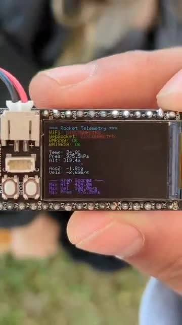

# BIP Rocket Data Acquisition

Model-rocket data logging project from the **SENSATE-X Darmstadt Rockets BIP (July 2025)**. I worked mainly on the Arduino/ESP32-S3 side of the project.

A short video of the display is in `docs/video/display_demo.mp4`.

## Hardware

- TS-ESP32-S3 development board
- BMP280 pressure sensor
- QMI8658C IMU
- 1.14 inch TFT display
- two Waveshare Core1262-HF SX1262 LoRa modules
- microSD card and SPI breakout
- LiPo battery

## Project setup

The original plan was to send data over LoRa from the rocket to a ground station. We could not get the radio link reliable enough during the BIP, so I changed the system to log data onboard to the microSD card instead.

The logged data included altitude/pressure and acceleration, with velocity estimated afterwards from the recorded flight data.

## Board connections

| Function | Pin / Address |
|---|---|
| TFT CS | GPIO 7 |
| TFT DC | GPIO 39 |
| TFT RST | GPIO 40 |
| TFT backlight | GPIO 45 |
| SPI SCK | GPIO 36 |
| SPI MISO | GPIO 37 |
| SPI MOSI | GPIO 35 |
| I2C SDA | GPIO 42 |
| I2C SCL | GPIO 41 |
| BMP280 | 0x77 |
| QMI8658C | 0x6B |

## Arduino sketch

The original 2025 team sketch is no longer available. The sketch in `src/reference/` was recreated from the hardware setup, course examples and the project material I still had. It is there to document the system rather than represent the exact code flown in 2025.

Development environment: **Arduino IDE (ESP32-S3)**
