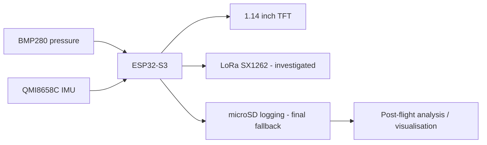

# BIP Rocket Data Acquisition & Telemetry

ESP32-S3 based model-rocket data acquisition project developed during the **SENSATE-X Darmstadt Rockets BIP (July 2025)** as part of a four-person international engineering team.

My main responsibility was embedded programming and telemetry/data acquisition.

## Project goal

Build an onboard system capable of recording flight data from a model rocket and making the results available for post-flight analysis.

The project used:

- **TS-ESP32-S3** development board
- onboard **BMP280** barometric pressure sensor
- onboard **QMI8658C** accelerometer / gyroscope
- onboard **1.14 inch TFT display**
- **Waveshare Core1262-HF (SX1262, EU868)** LoRa modules
- microSD card + SPI breakout
- small LiPo battery

## Architecture

## What happened during development

The initial plan used two SX1262 LoRa modules: one onboard the rocket and one at the ground station.

Reliable LoRa communication was not achieved within the project timeframe, so the design was adapted to **onboard microSD logging** to make sure flight data could still be captured. This was an important engineering trade-off: preserve the primary data-acquisition objective even when the preferred communications path was not reliable.

Recorded data included barometric/altitude information and acceleration data, with velocity estimated/derived during post-flight analysis.

## Board configuration used during the BIP

| Function | Pin / Address |
|---|---|
| TFT CS | GPIO 7 |
| TFT DC | GPIO 39 |
| TFT RST | GPIO 40 |
| TFT backlight | GPIO 45 |
| SPI SCK | GPIO 36 |
| SPI MISO | GPIO 37 |
| SPI MOSI | GPIO 35 |
| I2C SDA | GPIO 42 |
| I2C SCL | GPIO 41 |
| BMP280 | 0x77 |
| QMI8658C | 0x6B |

## Repository provenance

The **original 2025 team flight firmware was not retained**.

Code under `src/reconstructed/` was recreated in September 2026 from:

- the known project hardware
- BIP course starter material and sensor examples
- surviving project notes
- the project description and surviving display video

It is included as a **reference reconstruction**, not as a claim that this is the exact firmware flown in 2025.

This distinction is intentional: the repository documents the engineering project without inventing a false source-code history.

## Reconstructed reference implementation

`src/reconstructed/flight_logger.ino` demonstrates the core architecture that can be reproduced from the surviving material:

1. initialise the TFT, BMP280 and QMI8658C
2. sample pressure/altitude and acceleration
3. display live status
4. log timestamped samples to CSV on microSD
5. preserve the data for post-flight analysis

The microSD chip-select pin depends on the breakout wiring and must be set before use.

## Post-flight analysis

`tools/analyse_flight.py` reads the CSV logger output and derives a simple velocity estimate from altitude versus time. It also plots altitude, estimated velocity and acceleration magnitude.

## Engineering lessons

- Designing for graceful fallback matters in time-constrained projects.
- Telemetry and data acquisition should be separable: loss of a radio link should not mean loss of the flight data.
- Sensor sample rate, storage capacity and logging format need to be considered before flight.
- Barometric altitude and IMU acceleration provide complementary measurements with different error sources.
